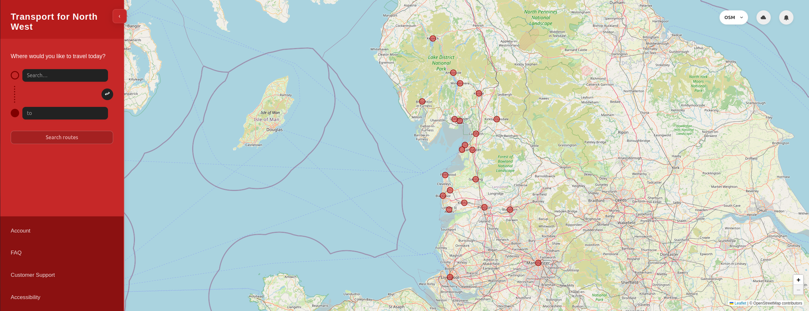
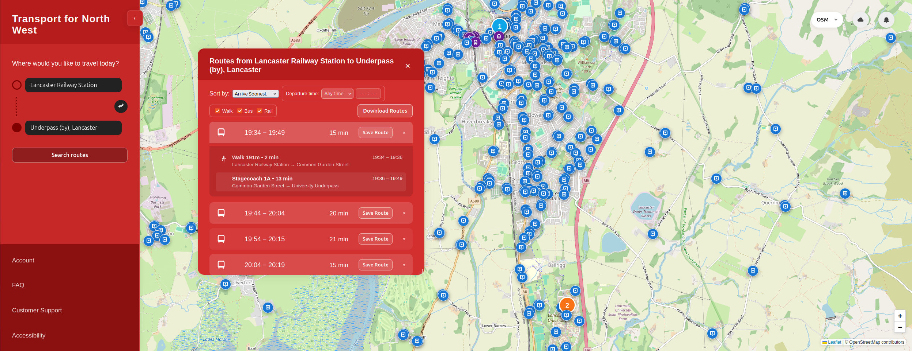
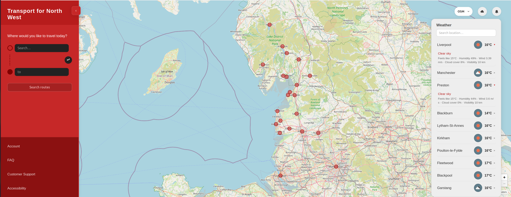
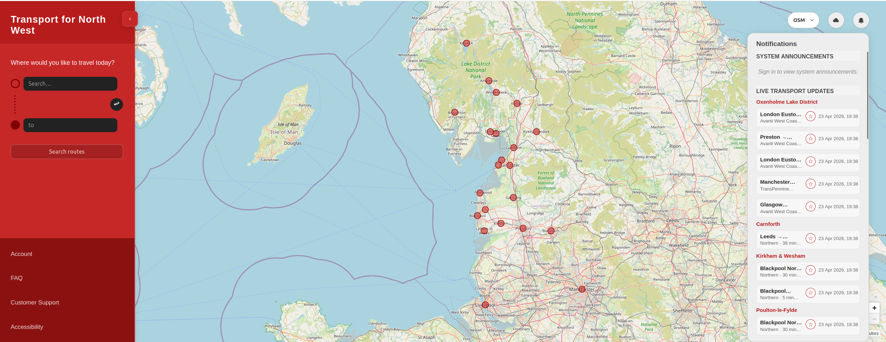
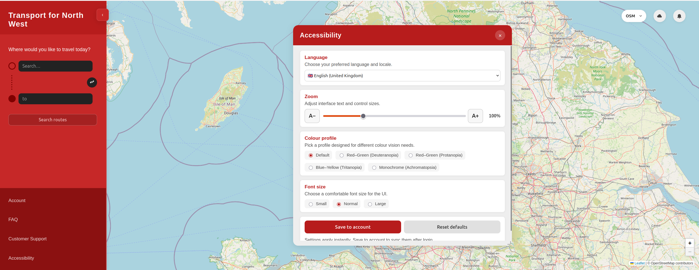
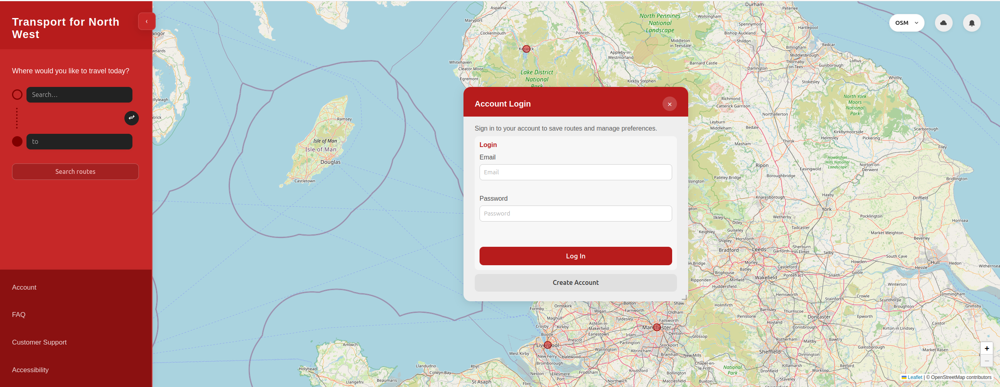
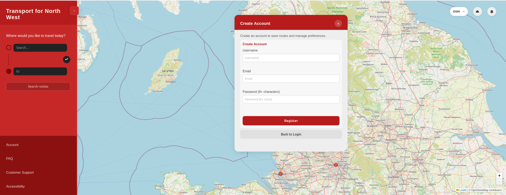
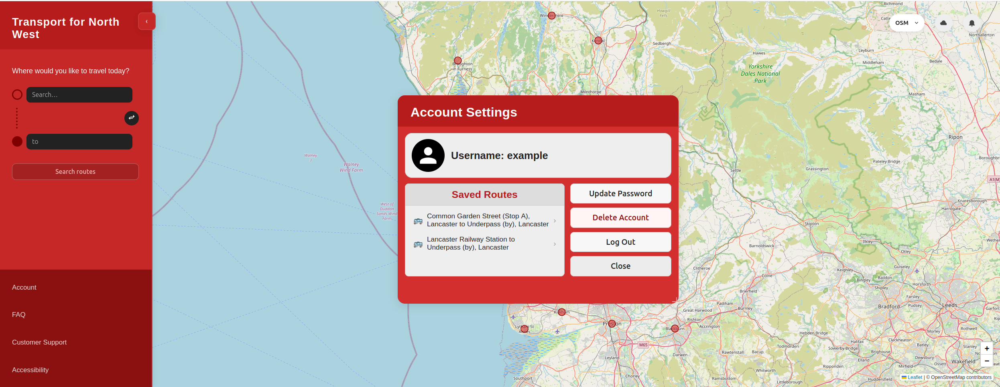

# Transport for North West - User Manual

This manual is for everyday users who want very clear instructions.
If you are not technical, follow the steps exactly and you will be fine.

---

## Contents

1. [What this website does](#what-this-website-does)
2. [Before you start](#before-you-start)
3. [Opening the website](#opening-the-website)
4. [Understanding the screen](#understanding-the-screen)
5. [How to search for a journey](#how-to-search-for-a-journey)
6. [How to read route results](#how-to-read-route-results)
7. [How to use the weather panel](#how-to-use-the-weather-panel)
8. [How to use notifications](#how-to-use-notifications)
9. [How to use accessibility settings](#how-to-use-accessibility-settings)
10. [How to create an account and log in](#how-to-create-an-account-and-log-in)
11. [How to use account settings and saved routes](#how-to-use-account-settings-and-saved-routes)
12. [FAQ and support](#faq-and-support)
13. [Troubleshooting](#troubleshooting)
14. [Privacy and safety tips](#privacy-and-safety-tips)

---

## What this website does

Transport for North West helps you:

- Search routes between two places
- See route details (times, changes, transport types)
- View weather updates for the region
- Check announcements and transport updates
- Adjust accessibility options (language, zoom, colours, font size)
- Create an account and save routes

---

## Before you start

You need:

- A phone, tablet, or computer
- Internet connection
- A browser (e.g. Chrome, Edge, Firefox, Safari)

Recommended:

- Use a large screen if possible (journey planning is easier)
- Keep your browser updated

---

## Understanding the screen

When the homepage opens, you will see:

- A **left sidebar** (journey search and menu links)
- A **main map area**
- Top-right buttons for **weather** and **notifications**

### Main areas explained

- **From** box: where your journey starts
- **To** box: where your journey ends
- **Search routes** button: starts the route search
- **Account / FAQ / Customer Support / Accessibility** links: opens each panel
- **Map Style selector**: changes map appearance
- **Sidebar toggle**: collapse or expand left panel

---

## How to search for a journey

### Simple journey search (step-by-step)

1. Click inside the **From** box.
2. Type your start place (for example, `Lancaster Railway Station`).
3. Choose the correct place from suggestions.
4. Click inside the **To** box.
5. Type your destination (for example, `Lancaster Underpass`).
6. Choose the correct place from suggestions.
7. Click **Search routes**.

If both places are valid, the route page opens in the map area.

### Swap start and destination

If you entered places the wrong way around:

1. Click the **swap** button between the two boxes.
2. Click **Search routes** again.

### Important tip

Do not just type random text and leave it.
Always pick a suggestion from the dropdown list when it appears.

---

## How to read route results

Route results are shown in a routes panel.

### What each route shows

- Start time and end time
- Total journey length
- Number of changes
- Transport type(s) used (bus/rail/walk)

### Sorting and filtering

Inside route results, you can:

- Sort by **Arrive Soonest**
- Sort by **Fewest Changes**
- Filter by departure time (Any / After / Before)
- Filter by transport mode (Walk / Bus / Rail)

### Expand route details

Click a route row to expand and view each journey stage, for example:

- Walk to stop
- Bus service details
- Rail service details
- Intermediate stops

### Download route PDF

Use **Download Routes** to export visible route options as a PDF file.

---

## How to use the weather panel

1. Click the **cloud icon** in the top-right corner.
2. The weather panel opens.
3. Scroll to see locations.
4. Use the weather search box to find a specific location.
5. Click a location row to expand detailed weather information.

Weather details can include:

- Current temperature
- Feels-like temperature
- Humidity
- Wind
- Cloud cover
- Visibility

---

## How to use notifications

1. Click the **bell icon** in the top-right corner.
2. The notifications panel opens.
3. Read the two sections:
   - **System Announcements**
   - **Live Transport Updates**

Use this panel to check:

- Planned maintenance updates
- Service delays/disruptions
- Important transport-wide notices

---

## How to use accessibility settings

1. Click **Accessibility** in the sidebar.
2. The accessibility panel opens.

### Available settings

- **Language**: choose your preferred language
- **Zoom**: increase/decrease interface size
- **Colour profile**: select colour-vision-friendly mode
- **Font size**: small, normal, large

### Save or reset

- Click **Save to account** to keep settings (requires login)
- Click **Reset defaults** to return to standard settings

Tip: If text is hard to read, first try **Zoom** and **Font size** together.

---

## How to create an account and log in

### Open account login

1. Click **Account** in the sidebar.
2. Login page opens.

### Log in (existing account)

1. Enter your email.
2. Enter your password.
3. Click **Log In**.

### Create a new account

1. In login page, click **Create Account**.
2. Fill in:
   - Username
   - Email
   - Password (minimum 8 characters)
3. Click **Register**.

### Password advice

Use a strong password with:

- 8+ characters
- Uppercase and lowercase letters
- A number
- A symbol

Try not to reuse passwords from other sites.

---

## How to use account settings and saved routes

After login/registration, account settings panel opens.

### What you can do in account settings

- View your username
- See saved routes
- Open a saved route again
- Update password
- Log out
- (Non-admin users) delete account

### Save a route

After running a route search:

1. Click **Save Route** on a route result.
2. The route is added to your saved routes list.

### Re-open a saved route

1. Open **Account**.
2. Click a saved route item.
3. The app fills journey inputs and runs route search.

### Log out

1. Open **Account**.
2. Click **Log Out**.

---

## FAQ and support

Use sidebar links for help:

- **FAQ**: common questions
- **Customer Support**: support channels and issue reporting guidance

When contacting support, include:

- Start and end locations
- Approximate time of your search
- What went wrong
- Screenshot (if possible)

---

## Troubleshooting

### I typed a place but no route appears

Try this:

1. Clear both journey boxes.
2. Re-type and choose suggestions from dropdown.
3. Click **Search routes** again.

### Weather or notifications not loading

- Check internet connection
- Wait a few seconds and retry
- Refresh the page once

### Accessibility setting did not stay saved

- Make sure you are logged in
- Click **Save to account** after changing settings

### I cannot log in

- Check email spelling
- Check password case (uppercase/lowercase matters)
- If still failing, create a new account or contact support

### The screen looks broken

- Refresh page
- Try another browser
- Disable aggressive ad/script blockers for this site

---

## Privacy and safety tips

- Never share your password with anyone.
- Log out on shared/public computers.
- Do not enter personal data in route names or notes.
- Only use official support channels.

---

## Quick checklist for new users

If you only read one section, read this:

1. Search route with **From** and **To**
2. Open **route details** to understand the journey
3. Check **weather** and **notifications** before leaving
4. Set up **accessibility** options for comfort
5. Create account to **save routes** and reuse later
